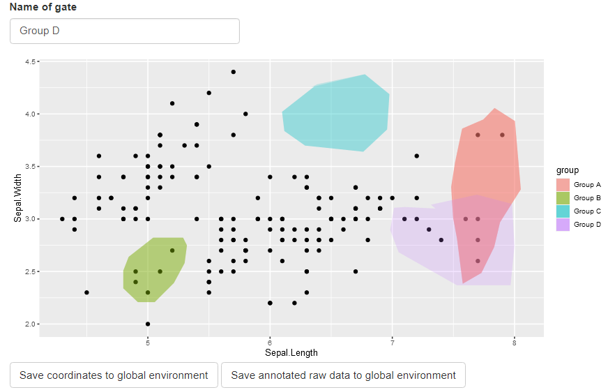

<!-- README.md is generated from README.Rmd. Please edit that file -->

# ggGate

<!-- badges: start -->
<!-- badges: end -->

ggGate enables interactive gating (ie., selection) of data points
underlying a ggplot2 object.

## Installation

You can install the development version of ggGate from
[GitHub](https://github.com/) with:

``` r
# install.packages("devtools")
devtools::install_github("northNomad/ggGate")
```

## Example

#### (1) Load package

``` r
suppressMessages(library(ggGate))
#> Warning: package 'shiny' was built under R version 4.1.2
```

#### (2) Using ggGate

``` r
#create ggplot2 object
p <- ggplot(iris, aes(Sepal.Length, Sepal.Width)) + geom_point()

ggGate(p, write_data_to = "df_new", write_gate_to = "df_gate")
```

1.  Name the current gate using the *Name of gate* text box

2.  Single-click on plot to create and draw gate

3.  Double-click on plot to finish gate

4.  Click on action buttons to save gate coordinates and annotated data



#### (3) Interpreting outputs

New columns corresponding to each gate are added to the data.frame
underlying the ggplot2 object.

The new columns store boolean values indicating if the data points
(rows) fall inside the respective gates.

``` r
colnames(iris)
#> [1] "Sepal.Length" "Sepal.Width"  "Petal.Length" "Petal.Width"  "Species"
colnames(df_new)
#> [1] "Sepal.Length" "Sepal.Width"  "Petal.Length" "Petal.Width"  "Species"     
#> [6] "Group A"      "Group B"      "Group C"      "Group D"
```

``` r
dplyr::select(df_new, starts_with("Group")) %>% colSums()
#> Group A Group B Group C Group D 
#>       6       5       0       8
```
